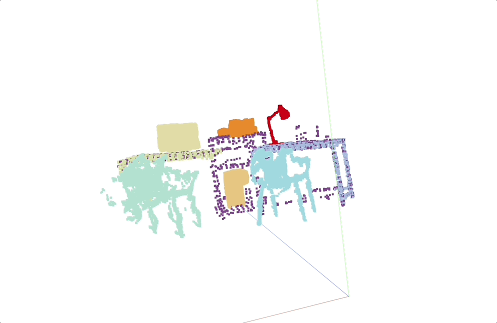

<p align="center">
  
</p>

# SpatialRGPT: Grounded Spatial Reasoning in Vision Language Models (NeurIPS'24)

[](CODE_LICENSE)
[](MODEL_LICENSE)


[](https://www.python.org/downloads/release/python-3100/)

[arxiv](https://arxiv.org/abs/2406.01584) / [Huggingface](https://huggingface.co/collections/a8cheng/spatialrgpt-66fef10465966adc81819723)

______________________________________________________________________

## 💡 Introduction

[**SpatialRGPT: Grounded Spatial Reasoning in Vision-Language Models**](<>)
<br>
[*An-Chieh Cheng*](https://www.anjiecheng.me/), [*Hongxu (Danny) Yin*](https://hongxu-yin.github.io/), [*Yang Fu*](https://oasisyang.github.io/), [*Qiushan Guo*](https://guoqiushan.github.io/), [*Ruihan Yang*](https://rchalyang.github.io/), [*Jan Kautz*](https://jankautz.com/), [*Xiaolong Wang*](https://xiaolonw.github.io/), [*Sifei Liu*](https://sifeiliu.net/)
<br>

SpatialRGPT is a powerful vision-language model adept at understanding both 2D and 3D spatial arrangements. It can process any region proposal, such as boxes or masks, and provide answers to complex spatial reasoning questions.

______________________________________________________________________

## 📢 News

- **Oct-07-24**- SpatialRGPT code/dataset/benchmark released! 🔥
- **Sep-25-24**- We're thrilled to share that SpatialRGPT has been accepted to NeurIPS 2024! 🎊

______________________________________________________________________

## Installation

To build environment for training SpatialRGPT, please run the following:

```bash
./environment_setup.sh srgpt
conda activate srgpt
```

______________________________________________________________________

## Gradio Demo

To run the Gradio demo for SpatialRGPT, please follow these steps. Due to `pydantic` version conflicts, the demo environment is not compatible with the training environment. Therefore, a separate environment will need to be created for the Gradio demo.

1. Build the environment.

   ```bash
   ./environment_setup.sh srgpt-demo
   conda activate srgpt-demo
   pip install gradio==4.27 deepspeed==0.13.0 gradio_box_promptable_image segment_anything_hq
   pip install -U 'git+https://github.com/facebookresearch/detectron2.git@ff53992b1985b63bd3262b5a36167098e3dada02'
   ```

   If you run into an error with the detectron2 installation, it could be because `CUDA_HOME` is not set. To fix this, export `CUDA_HOME` to your local CUDA path. See details in [this issue](https://github.com/AnjieCheng/SpatialRGPT/issues/6).

1. Clone the Depth-Anything repository and download the necessary checkpoint:

   ```bash
   git clone https://github.com/LiheYoung/Depth-Anything.git
   wget https://huggingface.co/spaces/LiheYoung/Depth-Anything/resolve/main/checkpoints/depth_anything_vitl14.pth
   ```

   Place `depth_anything_vitl14.pth` under `Depth-Anything/checkpoints`, and set the path to the environment variable. For example:

   ```bash
   export DEPTH_ANYTHING_PATH=/YOUR_OWN_PATH/Depth-Anything
   ```

1. Download SAM-HQ checkpoint from [here](https://drive.google.com/file/d/1qobFYrI4eyIANfBSmYcGuWRaSIXfMOQ8/view), and set the path to the environment variable. For example:

   ```bash
   export SAM_CKPT_PATH=/YOUR_OWN_PATH/sam_hq_vit_h.pth
   ```

1. Launch Gradio server. You can use your own checkpoint, or use `a8cheng/SpatialRGPT-VILA1.5-8B`

   ```bash
   cd demo
   python gradio_web_server_multi.py --model-path PATH_TO_CHECKPOINT
   ```

______________________________________________________________________

## Training

SpatialRGPT follows VILA training, which contains three steps. We provide training script for three different LLM models, `sheared_3b`, `llama2_7b`, `llama3_8b`. You can find the training scripts for each stage in the [scripts/srgpt](scripts/srgpt) folder.

______________________________________________________________________

## Open Spatial Dataset

Please download the Open Spatial Dataset from [huggingface](https://huggingface.co/datasets/a8cheng/OpenSpatialDataset), and modify the path in `llava/data/dataset_mixture.py`.

For raw images, please download OpenImages from [OpenImagesV7](https://storage.googleapis.com/openimages/web/download_v7.html). To process the rgb images into depth, we use [DepthAnythingV2](https://github.com/DepthAnything/Depth-Anything-V2) and save the depth with the following function:

<details>
<summary>Click to expand</summary>

```python
def save_raw_16bit(depth, fpath, height, width):
  depth = F.interpolate(depth[None, None], (height, width), mode='bilinear', align_corners=False)[0, 0]
  depth = (depth - depth.min()) / (depth.max() - depth.min()) * 255.0
  depth = depth.cpu().numpy().astype(np.uint8)
  colorized_depth = np.stack([depth, depth, depth], axis=-1)

  depth_image = Image.fromarray(colorized_depth)
  depth_image.save(fpath)
```

</details>

______________________________________________________________________

## Dataset Synthesis Pipeline

We've also made the dataset synthesis pipeline available. You can find the code and instructions in the [dataset_pipeline](dataset_pipeline) folder.
Please note that some of the packages we use have had version updates, and we've migrated to their latest versions. This may result in some bugs. Feel free to report any issues or unexpected results you encounter.

<p align="center">
  
</p>

______________________________________________________________________

## Evaluations

Our evaluation scripts takes the following arguments, `PATH_TO_CKPT`, `CKPT_NAME`, `CONV_TYPE`.

- `PATH_TO_CKPT` refers to the location of the checkpoint you want to evaluate.
- `CKPT_NAME` specifies the folder that will be created in the `eval_out` directory, where the evaluation results will be stored.
- Make sure that `CONV_TYPE` matches the conversation type used in the checkpoint. For `llama3_8b`, please use `llama_3`.

### Region Classification

First, prepare the evaluation annotation following [RegionCLIP](https://github.com/microsoft/RegionCLIP).
Then, use `scripts/srgpt/eval/coco_cls.sh PATH_TO_CKPT CKPT_NAME CONV_TYPE`.

### SpatialRGPT-Bench Evaluation

First, download the images from [omni3d](https://github.com/facebookresearch/omni3d), following there instructions. Then download annotations from [https://huggingface.co/datasets/a8cheng/SpatialRGPT-Bench](a8cheng/SpatialRGPT-Bench). Modify the path in `scripts/srgpt/eval/srgpt_bench.sh` to corresponding paths.

Note that for SpatialRGPT-Bench, you need to clone the Depth-Anything repository and download the necessary checkpoint:

```bash
git clone https://github.com/LiheYoung/Depth-Anything.git
wget https://huggingface.co/spaces/LiheYoung/Depth-Anything/resolve/main/checkpoints/depth_anything_vitl14.pth
```

Place `depth_anything_vitl14.pth` under `Depth-Anything/checkpoints`, and set the path to the environment variable.

```bash
export DEPTH_ANYTHING_PATH="PATH_TO_DEPTHANYTHING"
```

Then use `scripts/srgpt/eval/srgpt_bench.sh PATH_TO_CKPT CKPT_NAME CONV_TYPE`.

### General VLM Benchmarks

Our code is compatible with VILA's evaluation scripts. See [VILA/evaluations](https://github.com/NVlabs/VILA?tab=readme-ov-file#evaluations) for details.

______________________________________________________________________

## 📜 Citation

```bibtex
  @inproceedings{cheng2024spatialrgpt,
          title={SpatialRGPT: Grounded Spatial Reasoning in Vision-Language Models},
          author={Cheng, An-Chieh and Yin, Hongxu and Fu, Yang and Guo, Qiushan and Yang, Ruihan and Kautz, Jan and Wang, Xiaolong and Liu, Sifei},
          booktitle={NeurIPS},
          year={2024}
  }
```

______________________________________________________________________

## 🙏 Acknowledgement

We have used code snippets from different repositories, especially from: VILA, Omni3D, GLaMM, VQASynth, and ConceptGraphs. We would like to acknowledge and thank the authors of these repositories for their excellent work.
